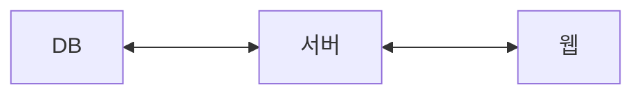

# 1. 문서 개요

## 1.1 개요

### 본 문서는 VibeSon 프로젝트 일환으로 SRS 작성 및 에이전틱 코딩을 위한 기능적 비기능적 요구사항을 작성한 문서임

 

## 1.2 목적

### IT 업에서 신입의 단순 코딩 비중이 줄었으며 순수 코딩 외의 역량을 기르기 위해 진행되는 프로젝트임. AI 에이전틱 코딩, SRS ICD 등 소프트웨어 스펙 문서 작성, 정보처리기사 이론의 실제 적용을 중점에 두고 진행함

 

## 1.3 용어

| 용어 |                                설명                                 |
| :--: | :-----------------------------------------------------------------: |
| 제목 |                      사용자가 직접 작성한 제목                      |
| 내용 |                   사용자가 직접 작성한 본문 내용                    |
| 개시 |  작성된 제목, 글을 데이터베이스에 저장 및 보드 화면에 띄우는 기능   |
| 수정 | 글의 제목 또는 내용을 수정하는 기능. 수정 후 즉시 데이터베이스 저장 |
| 삭제 | 선택된 글을 데이터베이스에서 삭제하는 동시에 게시판 목록에서 제외함 |

 

# 2. 시스템 개요

## 2.1 시스템 구성

3개의 부체계로 구성됨
| 부체계 | 구성 요소 | 주요 기능 |
| :---: | :---: | :---: |
| 서버 | REST API | 웹 서버 구축 및 동작에 사용 |
| 웹 대시보드 | 웹 브라우저 기반 게시판 | 작성된 글의 목록 및 수정/삭제 |
| DB | 작성된 글들을 저장하고 불러와 웹 대시보드에 표시 |

 

## 2.2 시스템 연결 구성도

웹은 글 작성 및 수정/삭제 요청을 서버에 보냄  
서버는 웹의 요청을 DB로 전달하고 DB의 정보(제목, 내용)를 웹에 전시함

 

# 3. 기능적 요구사항

## 3.1 웹

### 3.1.1 메인 게시판

| 요구사항 ID |                        요구사항 내용                        | 우선순위  |
| :---------: | :---------------------------------------------------------: | :-------: |
|   WB-M-01   |            작성된 글의 제목을 리스트업 하는 기능            |   필수    |
|   WB-M-02   |     리스트의 글 제목 클릭으로 본문을 읽을 수 있는 기능      |   필수    |
|   WB-M-03   | 글의 수가 많아지면 10개씩 나눠 페이지 번호로 글을 보는 기능 | 부가 기능 |
|   WB-M-04   |   글의 태그를 기준으로 필터링하여 글을 리스트업 하는 기능   | 부가 기능 |

### 3.1.2 글 작성 기능

| 요구사항 ID |                 요구사항 내용                 | 우선순위  |
| :---------: | :-------------------------------------------: | :-------: |
|   WB-W-01   |    글의 제목 및 내용을 작성하는 input area    |   필수    |
|   WB-W-02   |    html태그로 글 작성 및 스타일 삽입 지원     | 부가 기능 |
|   WB-W-03   |           글 중간에 그림 삽입 기능            |   필수    |
|   WB-W-04   | 삽입된 그림의 크기 및 본문과의 배치 지정 기능 |   필수    |
|   WB-W-05   |           글에 태그를 부여하는 기능           | 부가 기능 |

### 3.1.3 작성된 글 관리

| 요구사항 ID |                        요구사항 내용                        | 우선순위 |
| :---------: | :---------------------------------------------------------: | :------: |
|   WB-U-01   |           삭제 버튼을 클릭하면 글이 삭제되는 기능           |   필수   |
|   WB-U-02   | 수정 버튼을 클릭하여 글의 제목과 내용, 태그를 수정하는 기능 |   필수   |

## 3.2 서버

### 3.2.1 웹 요청 처리

| 요구사항 ID |                  요구사항 내용                  | 우선순위 |
| :---------: | :---------------------------------------------: | :------: |
|   SV-W-01   | 웹의 글 작성 요청 시 글 작성 페이지를 웹에 표시 |   필수   |
|   SV-W-02   |     수정 요청 시 글 수정 페이지를 웹에 표시     |   필수   |
|   SV-W-03   |     글 삭제/수정 시 메인 게시판 실시간 적용     |   필수   |

### 3.2.2 저장소 관리

| 요구사항 ID |                요구사항 내용                | 우선순위 |
| :---------: | :-----------------------------------------: | :------: |
|   SV-D-01   | 작성된 글의 제목 및 내용을 DB 테이블에 저장 |   필수   |
|   SV-D-02   |       글 삭제 시 DB 테이블에서도 삭제       |   필수   |
|   SV-D-03   |          DB 수정시 실시간 DB 조회           |   필수   |

## 3.3 DB

| 요구사항 ID |             요구사항 내용             | 우선순위 |
| :---------: | :-----------------------------------: | :------: |
|   DB-F-01   |    글의 제목 및 내용 저장 및 관리     |   필수   |
|   DB-F-02   |           글 작성 시간 저장           |   필수   |
|   DB-F-03   | 내용에 포함된 이미지 URL 저장 및 관리 |   필수   |
