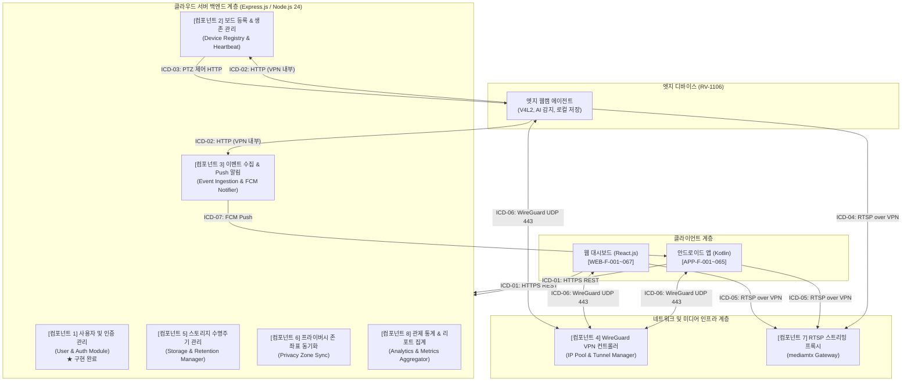
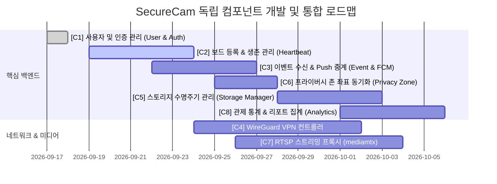

# SecureCam 시스템 컴포넌트 독립 구현 설계서 (Component Architecture)

> **문서 버전:** v1.0  
> **작성일자:** 2026-09-17  
> **적용 기준:** `SPEC/ICD.md`, `SPEC/FR/*`, `SPEC/NFR/*`  
> **목적:** SecureCam 보안 웹캠 시스템을 단일 책임 원칙(SRP)과 낮은 결합도(Loose Coupling)에 기반하여 독립적으로 개발·테스트·배포 가능한 8대 핵심 컴포넌트로 분할 정의함.

---

## 1. 전체 시스템 컴포넌트 아키텍처 다이어그램

---

## 2. 독립 구현 컴포넌트 상세 명세

### [컴포넌트 1] 사용자 및 인증 관리 컴포넌트 (User & Auth Module)

> **구현 현황:** `모듈/` 디렉토리에 100% 구현 및 28개 테스트 통과 완료

- **역할 및 책임**:
  - 사용자 계정 생성(회원가입), 자격 증명 검증(로그인), 세션 종료(로그아웃)
  - 아이디(이메일 마스킹) 및 비밀번호 찾기(일회용 보안 재설정 토큰 발급/변경)
  - 자동 로그인 지원 (ICD 1.3: 1년 525,600분 유효 JWT 토큰 발급 및 세션 유지)
  - 다중 기기 세션 추적, 목록 조회, 특정 기기 원격 강제 로그아웃
  - 구독 플랜(Basic/Standard/Premium)별 동시 접속자 수 및 기능 권한 차등 제어
- **관련 SPEC**:
  - `FR/SV_F.md`: **3.2.1 (SV-F-001 ~ SV-F-005)**
  - `ICD.md`: **ICD-01 2.1** 인증 API, **ICD-08 7.1.1** `users`, `user_sessions`
  - `NFR`: **NF-S-002** (bcrypt salt rounds 12), **NF-S-003** (JWT), **NF-P-005** (플랜별 동시접속 1/3/10대), **NF-S-005** (5회 실패 시 429 차단 및 이상 접근 감지)
- **독립 작동 인터페이스**:
  - **입력**: `-`, `-`, `-`, `-`, -`, `-`, `-`
  - **제공 미들웨어**: `authenticate` (JWT Bearer 검증), `requirePlan` (플랜 등급 검증), `loginRateLimiter` (Brute-force 방어)
  - **저장소**: PostgreSQL 17.X 또는 In-Memory Dual Driver 지원

---

### [컴포넌트 2] 보드 등록 & 생존 관리 컴포넌트 (Device Registry & Heartbeat Component)

- **역할 및 책임**:
  - QR 코드, 시리얼 번호, 등록 코드를 통한 웹캠 보드 등록 및 소유자 매핑
  - 웹캠 보드가 30초 주기로 송신하는 Heartbeat 수신 및 실시간 생존 상태 갱신
  - TTL(Time-To-Live) 기반 타이머를 통한 오프라인 감지 및 상태 전환 이벤트 발행
  - 클라우드 서버에서 웹캠 보드로 전달하는 PTZ(상하좌우 회전, 줌) 원격 제어 중계
- **관련 SPEC**:
  - `FR/SV_F.md`: **3.2.2 (SV-F-010 ~ SV-F-014)**, **WC-F-030, WC-F-031, WC-F-033**, **DB-F-002**
  - `ICD.md`: **ICD-01 2.2** (보드 관리 API), **ICD-02 3.1** (프로비저닝), **ICD-02 3.2** (Heartbeat), **ICD-03 3.4** (PTZ 제어), **ICD-08 7.1.2** (`devices`)
  - `NFR`: **NF-P-003** (보드 상태 갱신 주기 30초 이내), **NF-A-001** (가용성 99.5% 이상)
- **독립 작동 인터페이스**:
  - **외부 REST API (앱/웹)**:
    - `-`: 로그인 사용자의 등록 보드 전체 목록 조회
    - `-`: 보드 신규 등록 (qr / serial / code)
    - `-`: 보드 상태, VPN IP, RTSP 스트림 URL 조회
    - `-`: 보드 이름, 설치 위치 수정
  - **내부 REST API (보드 ↔ 서버, VPN 내부망 HTTP)**:
    - `-`: 보드 부팅 시 VPN 키/IP 발급 요청 (ICD 3.1)
    - `-`: 30초 주기 상태 보고 (ICD 3.2, 204 No Content)
    - `-`: PTZ 제어 명령 중계 (ICD 3.4)
- **독립 테스트 방안**:
  - Mock 보드 에뮬레이터(Node.js/Python 스크립트)를 통해 30초 주기 Heartbeat 발송 및 타임아웃 오프라인 전환 검증

---

### [컴포넌트 3] 이벤트 수집 & Push 알림 중계 컴포넌트 (Event Ingestion & Push Notification Engine)

- **역할 및 책임**:
  - 웹캠 보드가 감지한 움직임/소리/연결/시스템 이벤트 수신 및 DB 저장
  - 이벤트 발생 전후 스냅샷(JPG) 이미지 및 영상 클립(MP4) 연계 메타데이터 기록
  - 미확인/확인 완료 상태 관리 및 메모 입력
  - 이벤트 발생 시 사용자별 알림 설정(`ICD 2.7`)에 맞춰 FCM(Firebase Cloud Messaging) Push 알림 즉시 발송
- **관련 SPEC**:
  - `FR/SV_F.md`: **3.2.3 (SV-F-020 ~ SV-F-024)**, **WC-F-010 ~ 014**, **APP-F-030 ~ 035**, **DB-F-003**
  - `ICD.md`: **ICD-01 2.3** (이벤트 API), **ICD-01 2.7** (알림 설정 API), **ICD-02 3.3** (`-`), **ICD-07** (FCM Push 규격), **ICD-08 7.1.3** (`events`)
  - `NFR`: **NF-P-002** (이벤트 알림 전송 지연 5초 이내), **NF-S-005** (이상 접근 시 알림)
- **독립 작동 인터페이스**:
  - **내부 수신 API**: `-` (보드 → 서버, `serial_no`, `event_type`, `occurred_at`, `snapshot_data`, `sound_level_db`)
  - **외부 조회/관리 API**: `-` (페이지네이션, 기간/기기/유형별 필터), `-` (확인 처리, 중요 지정, 메모 저장)
  - **FCM 푸시 서비스**: 이벤트 수신 시 비동기 큐를 거쳐 5초 이내 FCM HTTP v1 API 호출
- **독립 테스트 방안**:
  - FCM SDK를 Stub/Mocking하여 이벤트 수신 즉시 5초 이내 알림 페이로드 생성 및 발송 여부 검증

---

### [컴포넌트 4] WireGuard VPN 컨트롤러 (VPN IP Pool & Tunnel Manager)

- **역할 및 책임**:
  - WireGuard 가상 사설망(`-`) 환경에서 보드 및 클라이언트에 사설 IP 자동 할당 및 회수
  - 보드 IP 풀(`- ~ -`) 및 모바일/웹 클라이언트 IP 관리
  - 기기별 VPN 공개키(wg_pubkey) 등록 및 서버 설정 동기화
  - 연결 상태(`connected`, `disconnected`, `error`) 및 최근 핸드셰이크 실시간 모니터링
  - 관리자/사용자에 의한 특정 기기 VPN 수동 연결 및 끊기 명령 처리
- **관련 SPEC**:
  - `FR/VPN_F.md`: **VPN-F-001 ~ VPN-F-007**, **SV-F-014**, **DB-F-004**
  - `ICD.md`: **ICD-01 2.5** (VPN 관리 API), **ICD-06 5.1 ~ 5.3** (WireGuard 규격: UDP 443, ChaCha20Poly1305, Keepalive 25초, MTU 1420), **ICD-08 7.1.4** (`phones`)
  - `NFR`: **NF-S-001** (모든 통신 구간 암호화), **NF-A-002, 003** (연결 끊김 시 60초 이내 자동 재연결)
- **독립 작동 인터페이스**:
  - **REST API**:
    - `-`: 등록 기기의 VPN 연결 상태 전체 목록 조회
    - `-`: VPN 수동 연결(`connect`) 또는 끊기(`disconnect`)
  - **OS 레벨 연동**: Linux `wg`, `wg-quick`, `iptables` 명령 또는 `/etc/wireguard/wg0.conf` 동적 갱신 인터페이스
- **독립 테스트 방안**:
  - 가상 IP 할당 알고리즘 및 IP 풀 충돌 방지 로직 단위 테스트, Mock WireGuard 인터페이스 검증

---

### [컴포넌트 5] 스토리지 수명주기 & 용량 관리 컴포넌트 (Storage & Retention Manager)

- **역할 및 책임**:
  - 이벤트 스냅샷(JPG) 및 녹화 클립(MP4) 파일의 메타데이터 DB 관리
  - 파일 다운로드, 일괄 삭제, 이름 변경 API 제공
  - 구독 플랜별 클라우드 저장 용량(Basic 5GB, Standard 30GB, Premium 100GB) 실시간 사용량 조회 및 초과 제한
  - 오래된 파일 자동 삭제 스케줄러 (Basic 7일, Standard 30일, Premium 90일 경과 시 자동 영구 삭제)
- **관련 SPEC**:
  - `FR/SV_F.md`: **3.2.4 (SV-F-030 ~ SV-F-033)**, **WC-F-020 ~ 022**, **APP-F-040 ~ 045**, **DB-F-005**
  - `ICD.md`: **ICD-01 2.4** (저장 파일 API)
  - `NFR`: **NF-C-003** (MP4 H.264/H.265), **NF-C-004** (JPG 1920×1080)
- **독립 작동 인터페이스**:
  - **REST API**:
    - `-`: 저장된 이미지/영상 파일 목록 조회 (기기, 날짜, 파일형식 필터)
    - `-`: 파일 단건 또는 다중 일괄 삭제 (`file_ids: []`)
    - `-`: 현재 플랜 대비 실시간 용량 사용량(GB) 조회
  - **백그라운드 워커 (Cron Daemon)**: 매일 자정 기준 보관 일수 초과 파일 자동 검색 및 삭제
- **독립 테스트 방안**:
  - 로컬 파일 시스템 또는 모의 GCS 버킷에 가상 파일을 생성하고, 보관 주기 초과 시 자동 삭제 배치 동작 검증

---

### [컴포넌트 6] 프라이버시 존 좌표 동기화 컴포넌트 (Privacy Zone Sync Module)

- **역할 및 책임**:
  - 웹 대시보드 및 앱에서 설정한 사생활 보호 마스킹 영역 좌표(0.0~1.0 비율) CRUD 관리
  - 보드 1개당 최대 20개 영역 등록 제한 (플랜별: Basic 3개, Standard 10개, Premium 20개)
  - 보드로 프라이버시 존 좌표 동기화 명령 하달 (영상 왜곡/유출 방지를 위해 **보드 단에서 하드웨어 마스킹** 처리)
- **관련 SPEC**:
  - `FR/WC_F.md`: **WC-F-015**, `FR/APP_F.md`: **APP-F-065**, `FR/WEB_F.md`: **WEB-F-066**, `DB_F.md`: **DB-F-006**
  - `ICD.md`: **ICD-01 2.6** (프라이버시 존 API), **ICD-08 7.1.5** (`privacy_zones`)
  - `NFR`: **NF-S-004** ("프라이버시 존 영역 마스킹은 **보드 단에서 처리**")
- **독립 작동 인터페이스**:
  - **REST API**:
    - `-`: 특정 보드의 프라이버시 존 목록 조회
    - `-`: 신규 영역 추가 (`zone_name`, `coordinates: {x1, y1, x2, y2}`)
    - `-`: 영역 좌표 및 활성화 상태 수정
    - `-`: 영역 삭제
- **독립 테스트 방안**:
  - 0.0 ~ 1.0 비율 범위 유효성 검증, 보드 1대당 최대 개수 초과 제한 및 좌표 변환 로직 단위 테스트

---

### [컴포넌트 7] RTSP 미디어 스트리밍 중계 프록시 (RTSP Streaming Gateway / mediamtx)

- **역할 및 책임**:
  - 웹캠 보드가 H.265/H.264로 인코딩하여 VPN 터널을 통해 송출하는 RTSP 스트림(TCP 8554) 수신
  - 단일 카메라 실시간 스트림 및 다채널(4분할, 8분할, 16분할) 멀티뷰 클라이언트로 스트림 중계
  - 웹 브라우저 호환을 위한 WebRTC / HLS / LL-HLS 실시간 프로토콜 변환 지원
  - 고화질(1080p @ 30fps) 및 저화질(704×576 @ 15fps) 듀얼 스트림 라우팅
- **관련 SPEC**:
  - `FR/WC_F.md`: **WC-F-001 ~ 004**, `APP_F.md`: **APP-F-010, 020**, `WEB_F.md`: **WEB-F-010, 020**
  - `ICD.md`: **ICD-04** (보드 → mediamtx), **ICD-05** (mediamtx → 앱/웹), **제4장 스트리밍 규격**
  - `NFR`: **NF-P-001** (영상 스트리밍 지연 **3초 이내**), **NF-C-003** (H.265/H.264)
- **독립 작동 인터페이스**:
  - **입력 스트림**: `-` (고화질), `-` (저화질)
  - **출력 스트림**: RTSP over TCP, WebRTC(WHEP), HLS
  - **독립 아키텍처**: 오픈소스 `mediamtx` 독립 컨테이너/바이너리 및 설정 파일(`mediamtx.yml`)로 완전 격리 구동
- **독립 테스트 방안**:
  - FFmpeg 가상 스트림 송출기를 이용하여 더미 RTSP 영상을 보내고 3초 이내 레이턴시 및 WebRTC 변환 검증

---

### [컴포넌트 8] 관제 통계 및 리포트 집계 컴포넌트 (Analytics & Metrics Aggregator)

- **역할 및 책임**:
  - 일별/주별/월별 이벤트 발생 추이 데이터 집계
  - 움직임/소리/연결/시스템 오류 이벤트 유형별 비율 도넛 차트 통계
  - 카메라별 이벤트 발생 빈도 순위(TOP 10) 산출
  - 시간대별(0시~24시, 요일별) 이벤트 발생 빈도 히트맵(Heatmap) 계산
  - 웹 대시보드 로딩 최적화를 위한 5분/1시간 단위 사전 집계(Pre-aggregation) 캐싱
- **관련 SPEC**:
  - `FR/WEB_F.md`: **3.6.5 (WEB-F-040 ~ WEB-F-045)**, `DB_F.md`: **DB-F-007**
  - `NFR`: **NF-P-004** (웹 대시보드 페이지 로딩 시간 **3초 이내**)
- **독립 작동 인터페이스**:
  - **REST API**:
    - `-`: 기간별 이벤트 발생 추이
    - `-`: 이벤트 유형 비율 통계
    - `-`: 이벤트 상위 카메라 TOP 10
    - `-`: 24시간 시간대별 히트맵 통계
    - `-`: 기간 선택 PDF/CSV 통계 리포트 다운로드
- **독립 테스트 방안**:
  - 대량의 목업 이벤트 데이터를 기반으로 집계 쿼리 실행 속도(100ms 이내) 및 캐시 적중률 테스트

---

## 3. 컴포넌트 간 의존성 및 독립 구현 로드맵

### 컴포넌트별 구현 독립성 요약 매트릭스

| 컴포넌트 번호 | 컴포넌트 명칭              | 주 언어 / 프레임워크    | 타 컴포넌트 의존성 | 독립 개발 및 테스트 방안                     |
| :-----------: | :------------------------- | :---------------------- | :----------------: | :------------------------------------------- |
|    **C1**     | **사용자 및 인증 관리**    | Node.js 24 / Express    | **없음 (독립적)**  | In-Memory DB를 통한 28개 테스트 완료         |
|    **C2**     | **보드 등록 & 생존 관리**  | Node.js 24 / Express    |   C1 (인증 토큰)   | 보드 Heartbeat 발송 Mock 스크립트로 검증     |
|    **C3**     | **이벤트 수집 & 알림**     | Node.js 24 / Express    |       C1, C2       | 이벤트 발생 Mock 페이로드 + Mock FCM 검증    |
|    **C4**     | **WireGuard VPN 컨트롤러** | Node.js / Linux CLI     |    독립 인프라     | 가상 IP 할당 풀 알고리즘 단위 테스트         |
|    **C5**     | **스토리지 수명주기**      | Node.js (Cron, GCS SDK) |       C1, C3       | 로컬 가상 파일 생성 후 자동 삭제 주기 테스트 |
|    **C6**     | **프라이버시 존 관리**     | Node.js / Express       |       C1, C2       | 좌표 정규화(0.0~1.0) 검증 및 DTO 단위 테스트 |
|    **C7**     | **RTSP 스트리밍 프록시**   | mediamtx (Go binary)    |     C4 (VPN망)     | FFmpeg 더미 RTSP 송출 테스트                 |
|    **C8**     | **관제 통계 & 리포트**     | Node.js / PostgreSQL    |  C3 (이벤트 로그)  | 시뮬레이션 DB 데이터를 통한 집계 쿼리 검증   |
